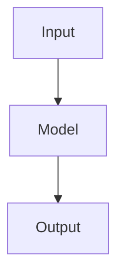

# ML Case Studies Blog

A clean, fast blog for ML engineering case studies built with Next.js + MDX + Tailwind.

## Tech Stack

- **Next.js 16** (App Router, static generation)
- **MDX** with `next-mdx-remote/rsc` for blog posts
- **Mermaid.js** for flowcharts inside MDX code blocks
- **Tailwind CSS** for styling
- **Vercel** for hosting (free)

## Adding a New Blog Post

1. Create a new file: `content/posts/your-post-slug.mdx`
2. Add frontmatter at the top:

```mdx
---
title: "Your Post Title"
date: "2025-07-01"
summary: "One-line description shown on homepage."
tags: ["Python", "FastAPI", "ML"]
github: "https://github.com/yourhandle/your-repo"
readTime: "8 min read"
---

## Your Content Here

Write in regular Markdown. Add flowcharts like this:



Link to GitHub, add tables, code blocks - all supported.
```

3. `git add . && git commit -m "add: your-post-title" && git push`
4. Vercel auto-deploys in ~30 seconds. Done.

## Deploy to Vercel (One-time Setup)

1. Push this repo to GitHub
2. Go to [vercel.com](https://vercel.com) → Import Project → pick your repo
3. Click Deploy (zero config needed)

Every future `git push` deploys automatically.

## Local Development

```bash
npm install
npm run dev
# Open http://localhost:3000
```
