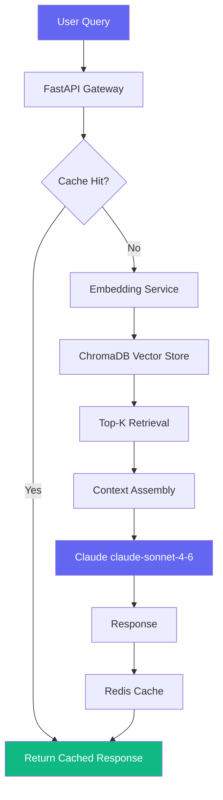
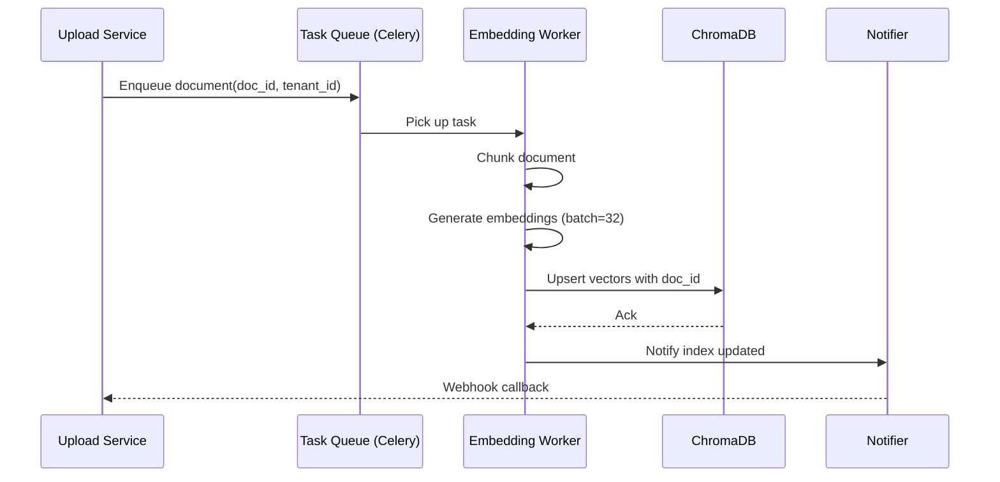

## Problem Statement

Most RAG tutorials show you how to query 5 PDFs. This case study covers what happens when you scale to **10,000+ documents** with real production constraints: latency budgets, stale index updates, and multi-tenant isolation.

The system needed to answer natural language questions over a corpus of e-commerce product manuals and support tickets, with responses in under 800ms.

## Architecture Overview

Here's the high-level flow of the system:



## Chunking Strategy

Naive chunking by token count destroys semantic coherence. We used a **hierarchical chunking** approach:

```python
from langchain.text_splitter import RecursiveCharacterTextSplitter

def chunk_document(text: str, doc_type: str) -> list[str]:
    if doc_type == "support_ticket":
        # Short docs: single chunk, preserve full context
        return [text] if len(text) < 1000 else chunk_recursive(text, 512, 50)
    
    # Product manuals: section-aware splitting
    return chunk_recursive(text, chunk_size=1024, overlap=128)

def chunk_recursive(text: str, chunk_size: int, overlap: int) -> list[str]:
    splitter = RecursiveCharacterTextSplitter(
        chunk_size=chunk_size,
        chunk_overlap=overlap,
        separators=["\n## ", "\n### ", "\n\n", "\n", " "]
    )
    return splitter.split_text(text)
```

The key insight: **separators are tried in order**. Section headers (`##`) are preferred split points, falling back to paragraphs, then lines, then spaces. This keeps logical units together.

## Embedding Model Choice

We benchmarked three models on our domain:

| Model | MTEB Score | Latency (p99) | Cost/1M tokens |
|---|---|---|---|
| `text-embedding-3-small` | 61.6 | 45ms | $0.02 |
| `text-embedding-3-large` | 64.6 | 120ms | $0.13 |
| `BAAI/bge-base-en-v1.5` | 63.7 | 12ms (self-hosted) | ~$0.001 |

We chose `bge-base-en-v1.5` self-hosted on a single A10G. The 5x latency win over the OpenAI large model mattered more than the 0.9 point quality gap for our use case.

## FastAPI Integration

The retrieval endpoint with proper async handling:

```python
from fastapi import FastAPI, Depends
from pydantic import BaseModel
import chromadb
import asyncio

app = FastAPI()

class QueryRequest(BaseModel):
    query: str
    tenant_id: str
    top_k: int = 5

@app.post("/retrieve")
async def retrieve(req: QueryRequest, chroma: chromadb.Client = Depends(get_chroma)):
    # Embed query async (non-blocking)
    embedding = await embed_text(req.query)
    
    # Tenant-isolated collection
    collection = chroma.get_collection(f"tenant_{req.tenant_id}")
    
    results = collection.query(
        query_embeddings=[embedding],
        n_results=req.top_k,
        include=["documents", "metadatas", "distances"]
    )
    
    return {
        "chunks": results["documents"][0],
        "sources": results["metadatas"][0],
        "scores": results["distances"][0]
    }
```

## Index Update Pipeline



Batching embeddings at size 32 gave us a **3.4x throughput improvement** over single-document processing. The async Celery worker means document ingestion never blocks the query API.

## Results

After 3 weeks in production:

- **P50 query latency**: 210ms (target: under 800ms ✅)  
- **P99 query latency**: 680ms ✅  
- **Answer relevance score**: 0.81 (evaluated on 200 human-labeled Q&A pairs)  
- **Index freshness**: documents searchable within ~45 seconds of upload

## Key Learnings

1. **Hybrid search beats pure vector search** — combining BM25 keyword scores with vector similarity (reciprocal rank fusion) improved relevance by ~12% on our eval set.
2. **Cache aggressively** — 38% of queries in our workload are near-duplicates. Redis with a semantic similarity threshold of 0.95 served those instantly.
3. **Chunk metadata matters** — storing `section_title`, `page_number`, and `doc_type` in ChromaDB metadata lets you filter before vector search, cutting retrieval time significantly.

## Source Code

Full implementation including Docker setup, Celery config, and eval harness on GitHub:
[github.com/faizan2700/rag-pipeline](https://github.com/faizan2700/rag-pipeline)
